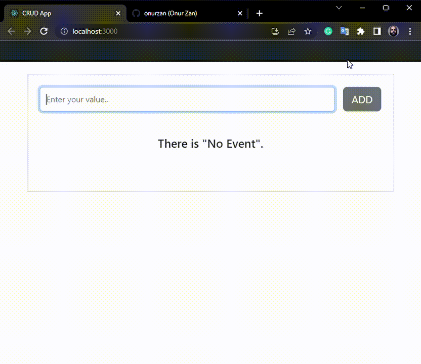

<h1>CRUD App with React.js</h1>

<h2>Used Tech</h2>

React.js

The main goal of the project is to understand the logic of "state" and "hook" using React.js and to use it for the main purposes of the project. The possibilities it provides are create, read, update and delete.

